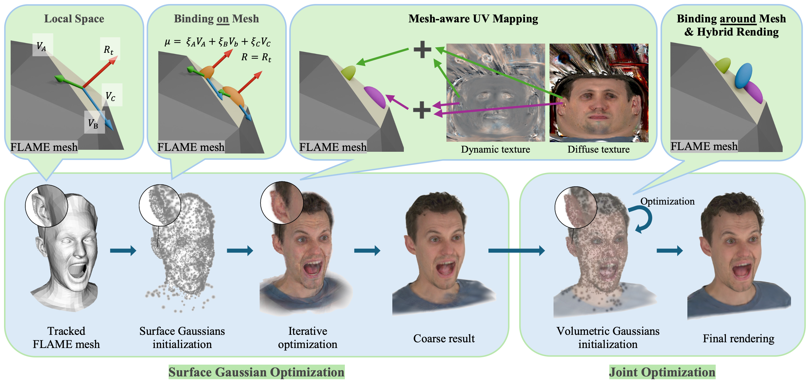

# SVG-Head: Hybrid Surface-Volumetric Gaussians for High-Fidelity Head Reconstruction and Real-Time Editing



[Project Page](https://github.com/heyy-sun/SVG-Head) | [arXiv Paper](https://arxiv.org/abs/2508.09597)

## Introduction

**SVG-Head** introduces a hybrid representation that combines surface and volumetric 3D Gaussians for high‑fidelity head reconstruction and real‑time editing.

## Prerequisites

- **OS**: Linux (tested on Ubuntu).
- **GPU**: CUDA-ready GPU with Compute Capability 7.0+ (12GB+ VRAM recommended for full quality).
- **Driver**: CUDA SDK 11.7 is recommended (avoid 11.6 due to known issues).
- **Compiler**: GCC for PyTorch extensions.

## Installation

We provide a streamlined setup using Conda.

```bash
# 1. Clone the repository
git clone https://github.com/heyy-sun/SVG-Head.git --recursive
cd SVG-Head

# 2. Create Conda environment
conda create --name svg-head -y python=3.10
conda activate svg-head

# 3. Install dependencies
# Note: Ensure CUDA toolkit matches the PyTorch CUDA version
conda install ninja
conda install -c "nvidia/label/cuda-11.7.1" cuda-toolkit
# Link libraries to prevent "cannot find -lcudart" errors
ln -s "$CONDA_PREFIX/lib" "$CONDA_PREFIX/lib64" 

# Install PyTorch
pip install torch==2.0.1 torchvision==0.15.2

# Install other requirements (this includes compiling custom CUDA kernels for diff-gaussian-rasterization)
pip install -r requirements.txt

# Note: If you encounter errors, try installing with --no-build-isolation:
# pip install -r requirements.txt --no-build-isolation

# Note: If you encounter OOM errors while compiling PyTorch3D via pip, you can install the pre-built binary:
conda install https://anaconda.org/pytorch3d/pytorch3d/0.7.7/download/linux-64/pytorch3d-0.7.7-py310_cu117_pyt201.tar.bz2
```

## Data Preparation

### 1. NeRSemble Dataset (Pre-processed)
We utilize the pre-processed data for 9 subjects from the [NeRSemble](https://tobias-kirschstein.github.io/nersemble/) dataset, as provided by the GaussianAvatars project.

You can download the data from:
*   **Direct Download (LRZ)**: [Link](https://syncandshare.lrz.de/getlink/fiRXRYvdGQoC162RZDDaZc/release)
*   **OneDrive**: [Access Link](https://tumde-my.sharepoint.com/:f:/g/personal/shenhan_qian_tum_de/EtgO7DSNVzNKuYMRQeL4PE0BqMsTwdpQ09puewDLQBz87A) (Requires application form [here](https://forms.gle/dPEJx5DNvmhTm2Ry5)).

Please extract the downloaded data into the `data/` directory.

> **Note**: Please ensure you cite the original NeRSemble paper if you use this data.

### 2. Custom Data
For your own videos, we recommend the [VHAP](https://github.com/ShenhanQian/VHAP) pipeline for head tracking and preprocessing.

### 3. FLAME Model
This project relies on the FLAME 2023 model. Please download the original assets from the [FLAME website](https://flame.is.tue.mpg.de/download.php) and place them in the following paths:

*   **FLAME 2023 (versions w/ jaw rotation)**: Rename to `flame2023.pkl` and place in `flame_model/assets/flame/`.

> **Note**: We use re-unwrapped and finer FLAME Vertex Masks, so downloading the original masks is not required.

## Usage

### Training

To train a model on a specific subject, run the following command. The `--eval` flag enables train/test splitting.

```bash
# Example: Training on subject 306
export SUBJECT=306
python train.py \
    -s data/${SUBJECT}/UNION10_${SUBJECT}_EMO1234EXP234589_v16_DS2-0.5x_lmkSTAR_teethV3_SMOOTH_offsetS_whiteBg_maskBelowLine \
    -m output/UNION10EMOEXP_${SUBJECT}_eval_600k \
    --port 60000 --eval --white_background
```

Common arguments:
*   `-s`: Path to source data.
*   `-m`: Output directory for the model.
*   `--eval`: Enable train/test split for evaluation.
*   `--white_background`: Use white background (match dataset if rendered on white background).
*   `--port`: Port for the remote training viewer.

Tips:
*   The output folder `-m` should be unique per run to avoid overwriting checkpoints.
*   If you plan to monitor training, run `python remote_viewer.py --port 60000` in another terminal.

### Rendering

Render the trained model using `render.py`.

```bash
# Example: Rendering subject 306
export SUBJECT=306
python render.py \
    -m output/UNION10EMOEXP_${SUBJECT}_eval_600k \
    -s data/${SUBJECT}/UNION10_${SUBJECT}_EMO1234EXP234589_v16_DS2-0.5x_lmkSTAR_teethV3_SMOOTH_offsetS_whiteBg_maskBelowLine \
    --skip_gt --skip_test --skip_val \
    --select_camera_id 7 \
    --iteration 660000 \
    --use_pts
```

Common arguments:
*   `-m`: Trained model directory (same as training output).
*   `-s`: Source dataset path (same as training input).
*   `--iteration`: Checkpoint iteration to render. Use `-1` to load the latest.
*   `--select_camera_id`: Render a specific camera ID. Use `-1` to render all cameras.
*   `--skip_train` / `--skip_val` / `--skip_test`: Skip rendering splits.
*   `--skip_gt`: Skip saving ground-truth frames and GT video.
*   `--use_pts`: Enable point-based hybrid rendering.
*   `--render_mesh`: Also render mesh overlays to `renders_mesh`.
*   `--texture_path`: Replace FLAME texture with an RGBA image (alpha controls mask).
*   You can try textures in `edit_demos/` with `--texture_path`.

Tips:
*   If you see an empty render (no PNGs), check that `--select_camera_id` exists in the dataset or set it to `-1`.
*   Rendering writes PNGs under `output/.../NAME/ours_ITER/` and assembles MP4s with `ffmpeg` when frames exist.

### Evaluation

Compute PSNR, SSIM, and LPIPS metrics:

```bash
# Example: Evaluating subject 306
export SUBJECT=306
python eval.py -m output/UNION10EMOEXP_${SUBJECT}_eval_600k --use_pts
```

## Visualization

**Real-time Local Viewer**:
For high-quality real-time visualization after training:
```bash
export SUBJECT=306
python local_viewer.py --point_path output/UNION10EMOEXP_${SUBJECT}_eval_600k/checkpoint/iteration_660000/params.pth
```

**Remote Training Viewer**:
To monitor training progress dynamically:
```bash
python remote_viewer.py --port 60000
```

## Citation

If you use this code or method in your research, please cite our paper:

```bibtex
@InProceedings{Sun_2025_ICCV,
    author    = {Sun, Heyi and Wang, Cong and Xu, Tian-Xing and Huang, Jingwei and Kang, Di and Guo, Chunchao and Zhang, Song-Hai},
    title     = {SVG-Head: Hybrid Surface-Volumetric Gaussians for High-Fidelity Head Reconstruction and Real-Time Editing},
    booktitle = {Proceedings of the IEEE/CVF International Conference on Computer Vision (ICCV)},
    month     = {October},
    year      = {2025},
    pages     = {13326-13335}
}
```

## Acknowledgements

This codebase is built upon [Gaussian Splatting](https://github.com/graphdeco-inria/gaussian-splatting). We also incorporate components from [GaussianAvatars](https://github.com/ShenhanQian/GaussianAvatars) for data processing and FLAME integration. The viewer interface is adapted from [INSTA](https://github.com/Zielon/INSTA).
